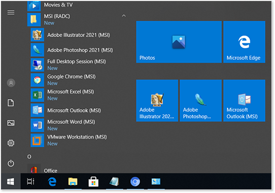

# rdpx

**rdpx** enables seamless remote access to applications running on another computer.

It makes use of Microsoft's RemoteApp technology that is built-in to Windows.

It is currently in the early stages of development. Check the Issues page to see what's planned.

### Screenshots

### Features

* Create and manage RemoteApps on Windows desktops and servers.
* A web interface to access your RemoteApps.
* Webfeed that Windows and mobile app clients can subscribe to.
  * Lists available RemoteApps in Windows clients' Start menu.
  * Lists available RemoteApps in the mobile app.
* Authentication (Windows credentials).

### Requirements

A ***supported*** edition of Windows XP, 7, 8, 10, or Server. See the [compatibility chart](https://github.com/kimmknight/remoteapptool/wiki/Windows-Compatibility).

### Downloads

[Lastest zip (v0.3.8.0) ](https://github.com/kimmknight/rdpx/releases/download/v0.3.8.0/rdpx.v0380.zip)

### Getting started

Install rdpx. Go to your Start Menu and run it from there. If you are running from source, run **Run server.bat**.

Once running, open a web browser and navigate to: http://127.0.0.1:8080/

Enter a Windows username and password when prompted.

Click the **New RemoteApp** button. Enter the name and path of the desired app, then click **Save**.

You are now ready to access your app(s) from another computer!

### Accessing your apps from another computer

You should now be able to access rdpx from another computer (on the same network).
Open a browser and navigate to http://x.x.x.x:8080/ (replace x.x.x.x with the host computer's IP address).

**Note:** You may need to open a firewall port (TCP/8080 by default) on the host before you can access rdpx from another computer on your network.

You can **change the TCP port** that rdpx uses from **8080** to something else in **Settings > Web Interface**.

To allow **remote access from the internet**, there are a few options:

* Set up a VPN server to allow secure remote access into your network.
  DIY setup is a little involved. Alternatively, you could use a service like [Hamachi](https://www.vpn.net/) - free for up to 5 devices.

* Use a Remote Desktop Gateway server.
  Requires Windows Server.

* On your router, port-forward TCP/8080 and TCP/3389 to the host running rdpx.
  **Extreme security risk, do not actually do this.**

  

### Webfeed

The Webfeed feature allows Windows and mobile app clients to subscribe to rdpx's RemoteApps.

* For Windows clients, it will keep an up-to-date list of RemoteApps in the clients' Start Menu.
  Configure in **RemoteApp and Desktop Connections**.
* For mobile app clients, it provides an up-to-date list of RemoteApps directly in the app.
  In the **Microsoft Remote Desktop** app, click the + and add a **Remote Resource Feed**.

You can enable Webfeed in **Settings > Web Interface**. You should also set the server address manually in **Settings > Host**.

The Webfeed can be accessed using the url: https://x.x.x.x/webfeed

Webfeed requires HTTPS to work properly. Windows clients require a valid certificate whereas mobile clients can choose to ignore the certificate.

### Adding HTTPS

You can add HTTPS support using NGINX for Windows.

Copy the files provided in the rdpx **nginxconf** folder into NGINX's **conf** folder.

Replace the certificate/key files with your own if you need a valid certificate.

More information can be found in [README.md](nginxconf/README.md) in the nginxconf folder.
